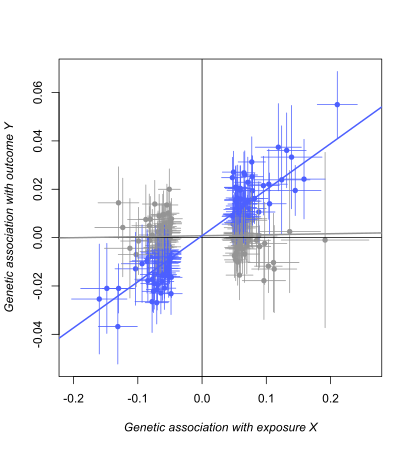

# PCMR: Pleiotropic Clustering of Mendelian Randomization

> This R package implements the PCMR method described in 

## Installation

```
# install.packages("devtools")
library(devtools)
install_github("856tangbin/PCMR")
```

## Usage 

PCMR is a clustering model for addressing various horizontal or vertical pleiotropic (HVP) effects. PCMR contains three components: 

- **Pleiotropic Clustering** (PCMR): Cluster instruments using the function of `PCMR`;
- **Heterogeneity test** (PCMR's pleiotropy test): Detect the presence of correlated horizontal pleiotropy using the function of `PCMR_testCorPlei`;
- **Causal analysis** (PCMR's causality evaluation): Evaluate whether a discernible dominant IV category supports a non-zero causal effect using the function of `PCMR_testCausal`.

## Example

> In the application from schizophrenia to major depressive disorder 

Instrument variables: [IVs_scz_mdd.csv](data\scz_mdd\IVs_scz_mdd.csv) 
Random sample variants: [initEst_scz_mdd.csv](data\scz_mdd\initEst_scz_mdd.csv) 

These datasets are obtained through functions in the R package cause, as detailed: linkkkkkkkkkkkkkkkkkkkkkkkkkkk

### 1. Estimating initial value

```R
set.seed(100)

# sigma2: the variance of uncorrelated horizontal pleiotropy
# rho: the parameter for sample overlapping
init = PCMR_initEst(X_clump1$beta_hat_1,X_clump1$seb1,
             X_clump1$beta_hat_2,X_clump1$seb2)
```

```
> init
$sigma2
[1] 0.000000e+00 1.992793e-05

$rho
[1] 0.01972954
```

If there is only data for IVs, you can set the initial values sigma2 and rho to zero.

### 2. Pleiotropic Clustering

- **The fixed effect model of PCMR**

```R
result_fixed = PCMR(X_clump$beta_hat_1, X_clump$seb1,
              X_clump$beta_hat_2,X_clump$seb2,num_gamma = 2,model="2",
              isIntact=T,rho=init$rho,sigma2 = init$sigma2)
```

```
> result_fixed$gamma
  33.33333%   66.66667% 
0.004115136 0.190450597 

> result_fixed$pi_gamma
[1] 0.4811426 0.5188574

> PCMR_plot(result_fixed)
```



- **The random effect model of PCMR**

```R
result_random = PCMR(X_clump$beta_hat_1, X_clump$seb1,
              X_clump$beta_hat_2,X_clump$seb2,num_gamma = 2,model="1",
              isIntact=T,rho=init$rho,sigma2 = init$sigma2)
```

```
> result_random$gamma
 33.33333%  66.66667% 
0.01703264 0.18722993 
> 
> result_random$pi_gamma
[1] 0.4981254 0.5018746
> 
> PCMR_plot(result_random)
```


### 3. Heterogeneity test in detecting correlated horizontal pleiotropy

```
library(parallel)
result_fixed = PCMR_testCorPlei(result_fixed,samples = 100,cores=15)
result_random = PCMR_testCorPlei(result_random,samples = 100,cores=15)
```

Note: In order to speed up the calculation, we set the sample size of bootstrapping to 100. The default setting is 1000.

```
> result_fixed$CHVP_test
[1] 4.838838e-11
> 
> result_random$CHVP_test
[1] 2.620976e-07
```

This heterogeneity test is based on $\chi^2(1)$, in our paper, that **Correct the $P_{plei}$ of PCMR's pleiotropy test**

### 

```
result_fixed = PCMR_correct(result_fixed,ref_beta_outcome = X_clump1$beta_hat_2,ref_se_outcome = X_clump1$seb2,samples = 20, 
             sample_boot = 30)

result_random = PCMR_correct(result_random,ref_beta_outcome = X_clump1$beta_hat_2,ref_se_outcome = X_clump1$seb2,samples = 20, 
             sample_boot = 30)
```


