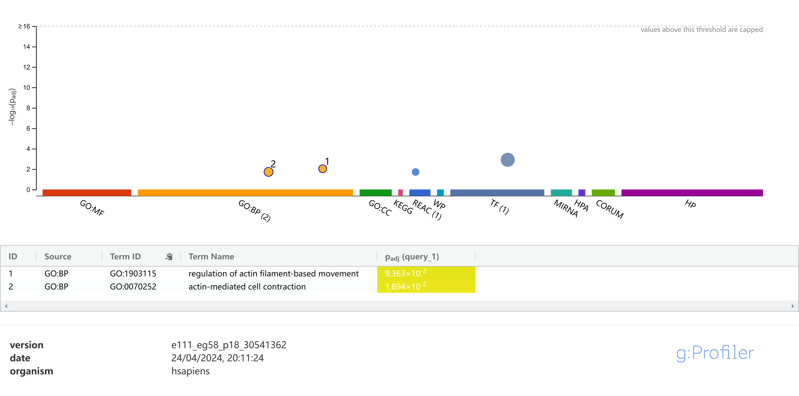

# PCMR: Pleiotropic Clustering of Mendelian Randomization

> This R package implements the PCMR method and provides efficient solutions and new insights for MR in clinically relevant or genetically overlapping traits.

## Usage 

PCMR is a clustering model for addressing various horizontal or vertical pleiotropic (HVP) effects. PCMR contains three components: 

- **Pleiotropic Clustering** (PCMR): Cluster instruments using the function of `PCMR`;
- **Heterogeneity test** (PCMR's pleiotropy test): Detect the presence of correlated horizontal pleiotropy using the function of `PCMR_testCorPlei`;
- **Causal analysis** (PCMR's causality evaluation): Suggest to Evaluate whether a discernible dominant IV category supports a non-zero causal effect using the function of `PCMR_testCausal`. Recommended to be applied in the presence of correlated horizontal pleiotropy, e.g. $P_{plei-test} <= 0.20$. 

## Installation

```R
# install.packages("devtools")
library(devtools)
install_github("856tangbin/PCMR")
```

## Example

> In the application from schizophrenia (SCZ) to major depressive disorder (MDD)

Instrument variables: [IVs_scz_mdd.csv](data\scz_mdd\IVs_scz_mdd.csv); Random sample variants: [initEst_scz_mdd.csv](data\scz_mdd\initEst_scz_mdd.csv). 

These instruments and random sample variants are obtained through functions in the R package cause, see`./demo/IVs_filter.R`. 

```R
library(PCMR)
library(parallel)

# X_clump = read.table("./data/scz_mdd/IVs_scz_mdd.csv",header=1,sep=",")
# X_clump1 = read.table("./data/scz_mdd/initEst_scz_mdd.csv",header=1,sep=",")
data(IVs_and_InitEst,package="PCMR")

set.seed(0)
# 0. Estimate initial values
init = PCMR_initEst(X_clump1$beta_hat_1,X_clump1$seb1,
                    X_clump1$beta_hat_2,X_clump1$seb2)

# 1. Pleiotropic clustering
result_random = PCMR(X_clump$beta_hat_1, X_clump$seb1,
              X_clump$beta_hat_2,X_clump$seb2,num_gamma = 2,model="1",
              isIntact=T,rho=init$rho,sigma2 = init$sigma2)

# 2. Heterogeneity test in detecting correlated horizontal pleiotropy
result_random = PCMR_cEst(result_random,ref_beta_outcome = X_clump1$beta_hat_2,ref_se_outcome = X_clump1$seb2,cores=10) # estimate the factor c
result_random = PCMR_testCausal_bootstrap(result_random,cores=10) # bootstrapping to estimate D_HVP
result_random = PCMR_testCorPlei(result_random) # calculate Pvalue of heterogeneity

# 3. Causality evaluation in the presence of correlated horizontal pleiotropy
# Recommended to be applied in the presence of correlated horizontal pleiotropy, e.g. P_{plei-test} <= 0.20. 
result_random = PCMR_testCausal(result_random)
```

*Note: The bootstrapping calculations are time-consuming this example. This example took about 30 minutes. You can also directly load the results of the completed calculations,* `data(scz_mdd_results,package="PCMR")`.


## Results

### 0. Estimating initial value

```
> init
$sigma2
[1] 0.000000e+00 1.992793e-05

$rho
[1] 0.01972954
```

If there is only data for IVs, you can set the initial values sigma2 and rho to zero.

### 1. Pleiotropic Clustering

The default model is the random effect model of PCMR (`model=1`).

```R
> result_random$gamma
 33.33333%  66.66667% 
0.01703264 0.18722993 

> result_random$gSigma2
[1] 0.004008198 0.002144189

> result_random$pi_gamma
[1] 0.4981254 0.5018746

> PCMR_plot(result_random)
```


### 2. Heterogeneity test in detecting correlated horizontal pleiotropy

```R
> print(c(result_random$c,result_random$c_sd))
[1] 2.7376126 0.4140901

> print(c(result_random$D_HVP))
[1] 39.4745

> print(c(result_random$CHVP_test,result_random$CHVP_test_Range)) # Pvalue of heterogeniety, and error range of this Pvalue
[1] 9.217905e-09 2.342845e-09 3.034035e-08
```

The heterogeneity test implies that there is in significantly correlated horizontal pleiotropy between SCZ between MDD ($P_{plei-test}=9.22\times 10^{-09}$). 

### 3.  Causality evaluation in the presence of correlated horizontal pleiotropy

```R
> print(result_random$Pvalue)
[1] 0.3290909
```

The results of PCMR's causality evaluation indicated that the causal effect of SCZ on MDD was insignificant ($P=0.329 > 0.05$).


## Integrating biological information for enhancing causal inference

The instrument classified by PCMR can be mapped into genes at the website: https://biit.cs.ut.ee/gprofiler/snpense, and then using those genes for enrichment analysis of biological process at the website: https://biit.cs.ut.ee/gprofiler/gost. The enrichment analysis may aid in identifying which IV category determines the causality.

```R
prb_thrd = 0.5
probability_1 = rowSums(result_random$W[,1,]) # the probability of IVs belonging to 1th IV category

stringi::stri_c(X_clump$rsid[probability_1 > prb_thrd],collapse = " ") # The IV category with correlated HVP effect of result$gamma[1] 
stringi::stri_c(X_clump$rsid[probability_1 < 1 - prb_thrd],collapse = " ") # The IV category with correlated HVP effect of result$gamma[1] 
```

**The IV category with correlated HVP effect of 0.01703264 (GRAY)**

```R
> stringi::stri_c(X_clump$rsid[probability_1 > prb_thrd],collapse = " ")
[1] "rs113113059 rs8073146 rs2840676 rs7515363 rs56335113 rs1915019 rs308697 rs1615350 rs6001259 rs167924 rs9876421 rs6549963 rs6538539 rs7575796 rs10086619 rs11210892 rs77492327 rs217336 rs2381411 rs39967 rs2910032 rs72802868 rs79212538 rs12771371 rs6984242 rs58120505 rs17731 rs4766428 rs16940992 rs10415576 rs2999392 rs3791710 rs2252074 rs12327967 rs778371 rs4575535 rs10117 rs9687282 rs416571 rs9393698 rs764284 rs12540417 rs7801375 rs2894222 rs9270836 rs215412 rs7647398 rs1430894 rs80094991 rs5751191 rs1451488 rs7563610 rs56245805 rs12991836 rs16825349 rs500102 rs7090337 rs9454727 rs324017 rs61937595 rs2013949 rs1901512 rs10861176 rs2455415 rs10035564 rs34611983 rs17194490 rs12285419 rs3729986 rs6926151 rs71301816 rs4779050 rs867810 rs3795310 rs246024 rs11993663 rs4921741 rs72974238 rs4902961 rs2965189 rs72986630 rs6482437 rs16867571 rs7803571 rs2944839 rs11954859 rs73229090 rs113264400 rs1792709 rs17571951 rs12883788 rs2053079 rs12865628 rs6546857 rs2802535 rs62183855 rs34879738 rs2935244 rs10108980 rs72980087 rs7115692 rs893949 rs7112912 rs3016386 rs79445414 rs713692 rs6798742 rs9813516 rs2909457 rs35734242"
```



**The IV category with correlated HVP effect of 0.18722993 (BLUE)**


```R
> stringi::stri_c(X_clump$rsid[probability_1 < 1 - prb_thrd],collapse = " ")
[1] "rs6715366 rs12432904 rs12892189 rs11687313 rs3739118 rs11263861 rs12310367 rs10777956 rs4702 rs67439964 rs11136325 rs4129585 rs3824451 rs7927176 rs12293670 rs12652777 rs149165 rs7830315 rs11941714 rs13145415 rs117145318 rs2333321 rs61405217 rs12498839 rs6943762 rs13233308 rs16851048 rs4636654 rs11027839 rs2456020 rs198806 rs12199613 rs1796518 rs6909479 rs4712938 rs2531806 rs13195636 rs35531336 rs1265099 rs9272446 rs9461856 rs116416291 rs9461916 rs570263 rs9274623 rs209474 rs1144708 rs2967 rs11693094 rs12129573 rs6762456 rs12489270 rs5995756 rs9623320 rs699318 rs4812325 rs60135207 rs13016542 rs7900775 rs11191580 rs79780963 rs2815731 rs9910403 rs8055219 rs187557 rs10860960 rs1604060 rs2241033 rs56393513 rs4936277 rs4987094 rs2514218 rs1881046 rs79210963 rs634940 rs9304548 rs2710323 rs13080668 rs7634476 rs11638554 rs708228 rs35351411 rs3814883 rs2190864 rs7191183 rs72692857 rs13107325 rs7403630 rs11807834 rs72769124 rs145071536 rs9428966 rs4658559 rs2489213 rs7099380 rs6974218 rs74480281 rs11682175 rs12969453 rs74914300 rs72934602 rs4632195 rs9636107 rs505061 rs9318627 rs13407231 rs6701322 rs56205728 rs2255663 rs117472063 rs11664298 rs10894308 rs4936215 rs7001340 rs61786047 rs6520064 rs2238057 rs740417 rs12712510 rs6125656 rs926288"
```


The BLUE category showed significant enrichment in biological processes primarily related to signaling transmission, with chemical synaptic transmission being the second significant ($2.344\times 10^{-3}$), while the GRAY category exhibited enrichment in two biological processes. As psychiatric disorders are associated with signal transmission, the BLUE category with a larger correlated HVP effect might exhibit correlated horizontal pleiotropy. 

PCMR also contains a test based on bootstrapping against a particular correlated HVP effect. (If the effect is determined to be the causal effect, the bootstrapping test is a causal inference)：

```R
> print(c(result_random$bootstrap$mean_minClass,result_random$bootstrap$sd_minClass)) # bootstrapping for 1000 times
[1] 0.01759228 0.02066573

> result_random$bootstrap$P_min
[1] 0.3955003
```

Based on the smaller correlated HVP effect, there is an insignificant relationship from SCZ to MDD. 
